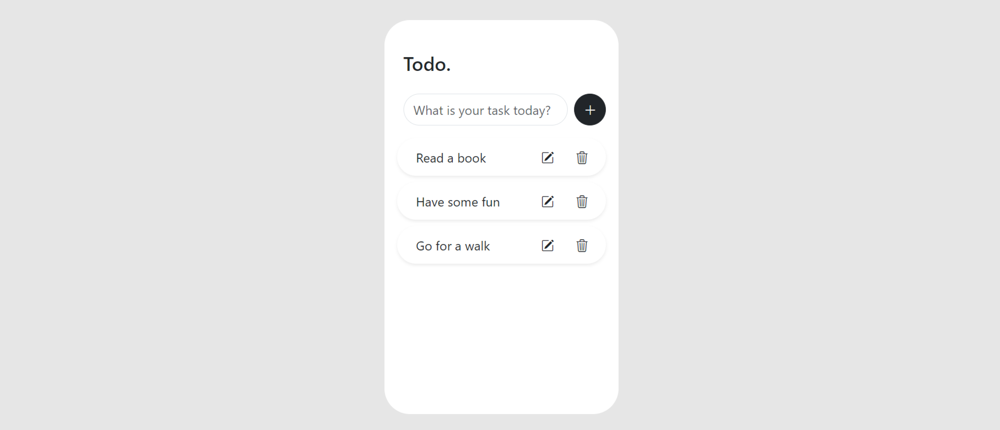

# To Do List App

Gestionnaire de tâches avec base de données.

## Fonctions

- L'utilisateur peut créer une liste de tâches, en ajoutant, modifiant et supprimant des tâches

- Formulaire pour ajouter une tâche
- Bouton pour modifier une tâche
- Bouton pour supprimer une tâche

- Récupération des informations de chaque tâche dans la base de données SQL et affichage côté client

## Technologies

- HTML
- PostgreSQL
- Node + Express
- React
- Bootstrap

## Back-end

- Serveur PostgreSQL

* Création des routes pour opérations CRUD : GET (liste des tâches/récupération de toutes les données), POST (création de tâche/ajout de donnée), DELETE (suppression d'une tâche/suppression de la donnée), PUT (modification d'une tâche/mise à jour de la donnée)

## Front-end

- Application React avec design minimal

## Utilisation

Lancer le repository.

Ouvrez un terminal dans Visual Code.
Tapez puis entrez : `cd .\server\`
Vous êtes dans le serveur.
Tapez et entrez : `node .\index.js`
Si le serveur tourne, vous devez recevoir comme réponse "server has started on port 5000"

Ouvrez un autr terminal.
Tapez puis entrez : `cd .\client\`
Vous êtes dans le client.
Tapez et entrez : `npm run start`

Une réponse vous renvoie un message indiquant que désormais vous pouvez avoir un aperçu du client dans votre navigateur, en suivant votre url local.

/!\ Problème de fonctionnalité du bouton "modifier"
Un encart apparaît pour modifier la tâche mais aucun action n'est possible. Ce problème est en cours de résolution.

### Objectifs futurs

- Débugger le bouton "Modifier"

* Rendre plus intuitif l'UX Design (ajout d'une checkbox)

- Rendre l'application responsive
